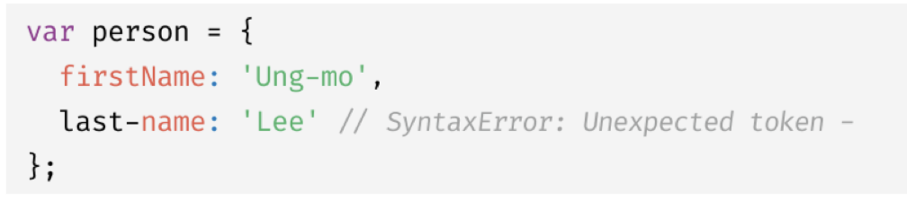

# 객체 리터럴

### 10.1 객체란 ?

자바스크립트는 객체 기반의 프로그래밍 언어이며, 원시 값을 제외한 나머지 값은 모두 객체다.
원시 값은 변경 불가능한 값이지만, 객체 타입의 값, 즉 객체는 변경 가능한 값이다.

원시 값: immutable value
객체: mutable value (변경 가능한 값)

<br>

### 10.3 프로퍼티



위와 같은 프로퍼티 key 값 ' last-name '은 식별자 네이밍 규칙을 따르지 않는다. <br>
따라서 -를 사용할 경우, 따옴표로 묶어야 한다.

<br>

### 10.4 메서드

JS의 함수는 일급 객체다.<br>
함수는 값으로 취급할 수 있다.<br>
따라서 함수를 프로퍼티의 값으로 사용할 수 있다.

프로퍼티 값이 함수일 경우 일반 함수와 구분을 위해 메서드라고 부른다. <br>즉, 메서드는 객체에 묶여있는 함수다.

<br>

### 10.8 프로퍼티 삭제

delete 연산자를 사용한다. <br>
이때 존재하지 않는 프로퍼티를 삭제하려 해도 에러가 발생하지 않는다.
이를 조심하자.

<br>

### 10.9 ES6에서 추가된 객체 리터럴의 확장 기능

메서드 축약 표현

```js
var obj = {
  name: "Lee",

  // 아래 메서드 부분을
  sayHi: function () {
    console.log("Hi! " + this.name);
  },
};

const obj = {
  name: "Lee",

  // 이렇게 축약할 수 있다.
  sayHi() {
    console.log("Hi! " + this.name);
  },
};
```
