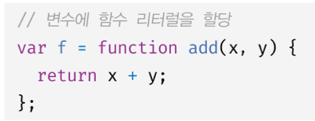
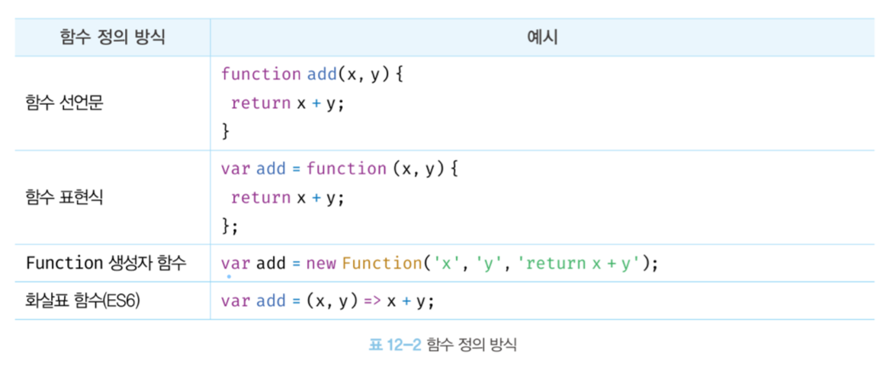
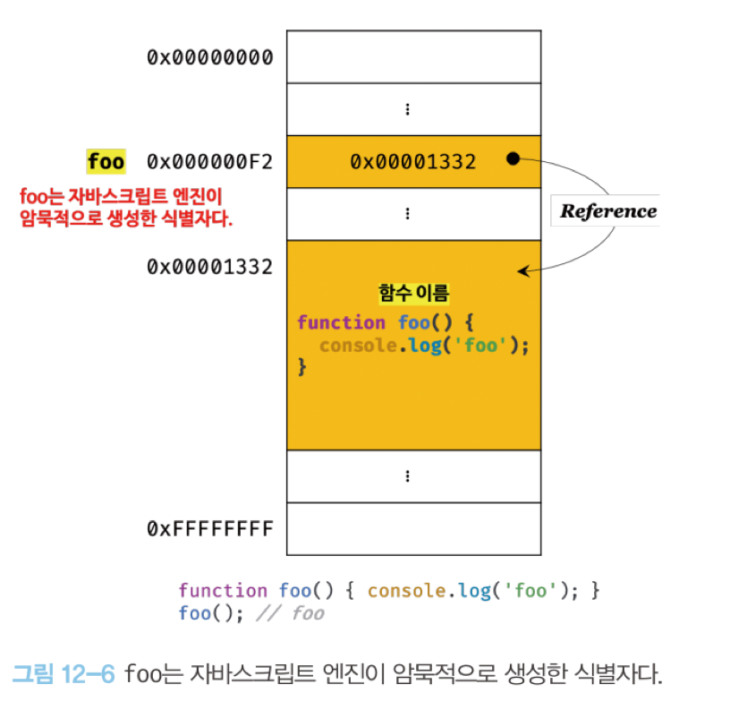
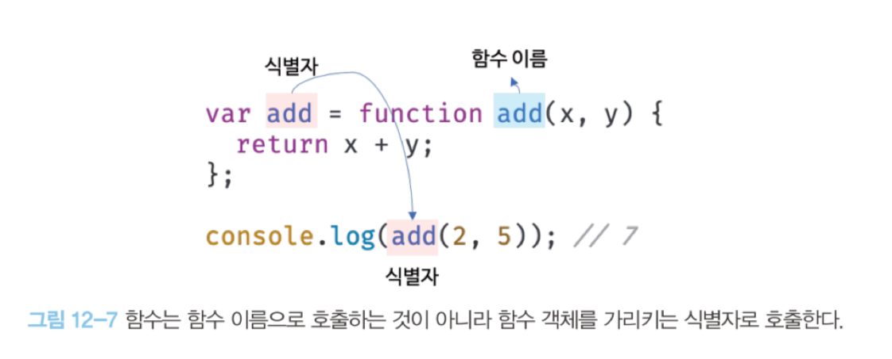
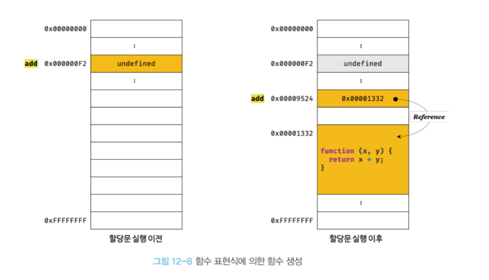
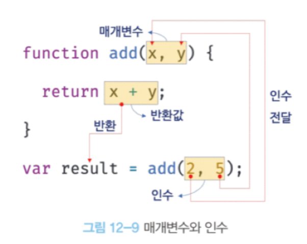

# 12장 함수

### 12.3 함수 리터럴

JS 함수는 객체 타입의 값이다. 따라서 함수도 리터럴을 통해 생성할 수 있다.



일반적으로 객체는 호출할 수 없지만, 함수는 호출할 수 있다.

<br>

### 12.4 함수 정의



- 변수 : '선언' 한다고 표현한다.
- 함수 : '정의' 한다고 표현한다

<br>

함수 선언문 특징

- 평가되면 식별자가 암묵적으로 생성되고 함수 객체가 할당된다.
- 함수 이름을 생략할 수 없다.
- `표현식이 아닌 문`이다.

참고 ) 표현식이 아닌 문은 변수에 할당할 수 없다.

하지만 아래 예제는 함수 선언문이 변수에 할당되는 것처럼 보인다.

```js
var add = function add(x, y) {
  return x + y;
};

// 함수 호출
console.log(add(2, 5)); // 7
```

이는 JS 엔진이 코드의 문맥에 따라 해석이 달라질 수 있기 때문이다.

```js
// 아래와 같이 기명함수를 단독으로 사용하면 함수 선언문으로 해석된다.
// 함수 선언문은 함수 이름을 생략할 수 없다.
function foo() {
  console.log("foo");
}
foo(); // foo

// 함수 리터럴을 피연산자로 사용하면 함수 선언문이 아니라 함수 리터럴 표현식으로 해석된다.
// 함수 리터럴에서는 함수 이름을 생략할 수 있다.
(function bar() {
  console.log("bar");
});
bar(); // ReferenceError: bar is not defined
```

위 코드를 보면

- foo 처럼 단독으로 사용된 함수 리터럴 => 함수 선언문
- bar 처럼 그룹 연산자 내에 사용된 함수 리터럴 => 함수 리터럴 표현식

로써 사용된다.

()라는 그룹 연산자 내에 피연산자는 표현식이어야 한다. <br>
때문에 함수 선언문(== 표현식이 아닌 문)은 피연산자로 사용할 수 없다.

<br>

같은 예제에서, foo는 호출이 가능하지만 bar는 호출이 불가능하다.

함수 리터럴에서 공부했듯, `함수 이름은 함수 몸체 내에서만 참조할 수 있는 식별자이다.` <br>
즉, 함수 몸체 외부에서 해당 함수를 참조할 수 없다는 것 == 함수를 가르키는 식별자가 없다는 것.

<br>

그러나 foo는 호출이 가능했다. <br>
foo도 함수 몸체 내부에서만 유효한 식별자이고, <br>
foo를 호출하고 싶다면 그 함수 객체를 가리키는 식별자가 있어야만 한다.

이것이 가능한 이유는 JS가 암묵적으로 식별자를 생성하기 때문이다.



JS가 함수 선언문을 해석해 함수 객체를 생성하면, <br>
함수 이름과 동일한 이름의 식별자를 암묵적으로 생성하고, 해당 함수 객체를 할당한다.

<br>

함수는 *함수 이름*으로 호출하는 것이 아닌, `함수 객체를 가리키는 식별자`로 호출한다.



(식별자와 함수 이름의 개념을 잘 구분하자.)

<br>

JS에서 함수는 `1급 객체`이다. <br>
그놈의 1급 객체가 도대체 무엇일까?

바로 `함수를 값처럼 자유롭게 사용할 수 있다는 것`이다.

함수가 값처럼 사용될 수 있기에, 이를 변수에다가 할당할 수 있다.

```js
var add1 = function foo(x, y) {
  return x + y;
};
var add2 = function (x, y) {
  return x + y;
};

console.log(add1(2, 5)); // 7
console.log(add2(2, 5)); // 7
```

이것이 `함수 표현식` 이다. <br>
이때 함수 리터럴은 **함수 이름을 생략할 수 있다**. (= 익명 함수)

<br>

- 함수 선언문 : "표현식이 아닌 문"
- 함수 표현식 : "표현식인 문"

<br>
표현식인지 아닌지에 어떤 차이가 있을까?

**함수 생성 시점**과 **함수 호이스팅**에 차이가 있다.

```js
// 함수 참조
console.dir(add); // f add(x, y)
console.dir(sub); // undefined

// 함수 호출
console.log(add(2, 5)); // 7
console.log(sub(2, 5)); // TypeError: sub is not a function

// 함수 선언문
function add(x, y) {
  return x + y;
}

// 함수 표현식
var sub = function (x, y) {
  return x - y;
};
```

함수 선언문은 var처럼 선언문 이전에 호출할 수 있다. <br>
하지만 함수 표현식은 그렇지 않다.

왜 그럴까? <br>
이는 함수의 생성 시점이 다르기 때문이다.

함수 선언문은 런타임 이전에, 함수 객체가 먼저 생성된다. <br>
이후 JS 엔진은 함수 이름과 동일한 이름의 식별자를 암묵적으로 생성하고, 해당 함수 객체를 할당한다.

즉, console.dir() 실행되기 전에 함수 선언문은 이미 함수 객체가 생성되어 있고, <br>
동일한 식별자에 할당까지 완료되어 있다.

이러한 특징을 `함수 호이스팅`이라고 한다.

<br>

참고 ) 변수 호이스팅과 함수 호이스팅은 조금 차이가 있다. <br>
var 키워드를 선언한 변수는 undefined로 초기화되지만, <br>
함수 선언문은 함수 객체로 초기화된다.

<br><br>

함수 표현식

함수 표현식은 `변수`에 할당되는 값이 `함수 리터럴`인 문이다. <br>
**변수 할당문의 값은 할당문이 실행되는 시점, 즉 런타임에 평가된다.** <br>
**때문에 함수 표현식의 함수 리터럴도, 할당문이 실행되는 시점에 평가되어 함수 객체가 된다.** <br>
따라서, `함수 표현식으로 함수를 정의하면 함수 호이스팅이 아닌, 변수 호이스팅이 발생한다.`



따라서 함수 표현식으로 정의한 함수는 반드시 함수 표현식 이후에 참조 또는 호출해야 한다.

함수 호이스팅은 함수를 호출하기 전, 함수를 선언해야 한다는 규칙을 무시한다. <br>
때문에 함수 표현식을 사용할 것을 권장한다.

<br>

#### 화살표 함수

- 생성자 함수로 사용할 수 없음.
- 기존 함수와 this 바인딩 방식이 다르다.
- prototype 프로퍼티가 없다.
- arguments 객체를 생성하지 않는다.

<br>

### 12.5 함수 호출



- 인수 : argument
- 인자 : parameter (= 매개변수)

parameter는 함수를 정의할 때 선언하고, 함수 몸체 내부에서 변수와 동일하게 취급된다. <br>
즉, 함수 몸체 내부에서 암묵적으로 매개변수가 생성되고, 일반 변수처럼 undefined로 초기화된다.
이후 parameter에 arguments를 할당.

<br>

**함수 호출은 표현식이다.**

#### 값

> 값은 식 (표현식)이 평가되어 생성된 결과를 말한다. <br>
> ex ) 10 + 20; // 30 <br>
> 10+20은 평가되어 숫자 값 30을 생성한다.

#### 리터럴

> 리터럴은 사람이 이해할 수 있는 문자 또는 약속된 기호를 사용해 값을 생성하는 표기법이다 <br>
> ex) 3 << 숫자 리터럴

#### 표현식

> 표현식은 값으로 평가될 수 있는 문이다. <br>
> 즉 표현식이 평가되면 새로운 값을 생성하거나 기존 값을 참조한다. <br>
> var score = 100;

#### 문

> 문은 프로그램을 구성하는 기본 단위이자 최소 실행 단위이다. <br>

```js
<script>
 var x; // 변수 선언문

 x = 5; // 할당문

function foo () {} // 함수선언문

if ( x > 1 ) {console.log(x);} //조건문

for ( var i = 0; i < 2 ; i ++) { console.log (i) ;} //반복문
</script>
```

<br>

### 12.7 다양한 함수의 형태

#### 즉시 실행 함수

```js
(function () { ~ })();
// ()()형태
```

즉시 실행 함수를 ()() 형태로 나타내지 않으면 왜 에러가 발생할까?

```js
function () { ~ }();
// SyntaxError: Function statements require a function name
```

이는 함수 정의가 함수 선언문 형식에 맞지 않기 때문. <br>
함수 선언문은 함수 이름을 생략할 수 없다. <br>

그럼 함수 이름을 넣으면 에러가 사라질까 ?

```js
function foo() { ~ }();
// SyntaxError: Unexpected token ')'
```

여기서도 에러 난다.

JS 엔진은 암묵적으로 세미클론 ;을 추가한다. <br>
때문에 함수 선언문 뒤에있는 ()를 함수 호출 연산자가 아니라, **그룹 연산자**로 해석한다.

때문에 아래와 같은 에러가 발생하는 것.

```js
();
// SyntaxError: Unexpected token ')'
```

즉시 실행 함수가 ()() 형태인 이유는,
먼저 함수 리터럴을 평가해서 함수 객체를 생성해서 사용하기 위해서이다.

<br><br>

- 콜백 함수 : 함수의 parameter로써 다른 함수 내부로 전달되는 함수.
- 고차 함수 : 외부로부터 parameter를 통해 콜백함수를 받은 함수.

때문에 콜백 함수는 고차 함수에 의해 호출된다. <br>
이때,고차 함수는 콜백 함수에 인수를 전달할 수도 있다~

예시로써는 map, filter, reduce 등등이 있다.

<br><br>

Side Effect : 함수 외부의 상태를 변경하는 것.
