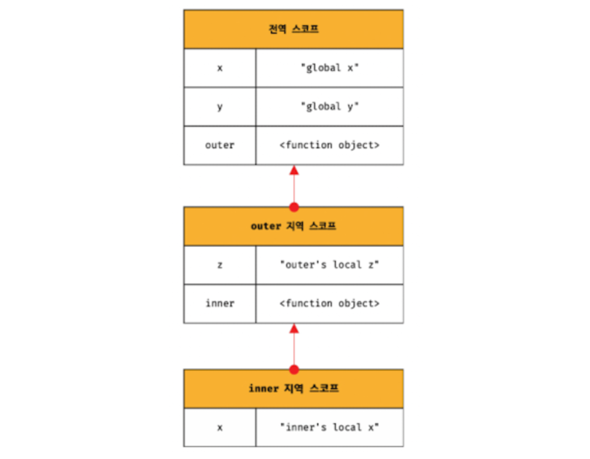

# 스코프 체인

함수 몸체 내부에서 정의한 함수 = 중첩 함수 
중첩 함수를 포함하는 함부 = 외부 함수

함수는 중첩될 수 있으므로 지역 스코프도 중첩될 수 있다. 이는 스코프가 함수의 중첩에 의해 계층적인 구조를 갖는다. 외부 함수의 지역 스코프를 중첩 함수의 상위 스코프라고 한다.

모든 스코프는 하나의 계층적 구조로 연결되며, 모든 지역 스코프의 최상위 스코프는 전역 스코프다. 이렇게 스코프가 계층적으로 연결된 것을 **스코프 체인**이라 한다.

스코프 체인의 최상위는 전역 스코프, 전역에서 선언된 외부 함수의 지역 스코프, 외부 함수 내부에 선언된 중첩 함수의 이렇게 3가지 스코프로 이루어 진다.

### 스코프 체인에 의한 변수 검색

변수를 참조할 때 자바스크립트 엔진은 스코프 체인을 통해 변수를 참조하는 코드의 스코프에서 시작하여 상위 스코프 방향으로 이동하며 선언된 변수를 검색한다. 이를 통해 상위 스코프에서 선언한 변수를 하위 스코프에서도 참조할 수 있다.

자바스크립트 엔진은 코드를 실행하기에 앞서 렉시컬 환경을 실제로 생성한다. 변수 선언이 실행되면 변수 식별자가 렉시컬 환경에 키로 등록되고 변수 할당이 일어나면 렉시컬 환경 변수 식별자에 해당하는 값을 변경한다.

변수 검색도 렉시컬 환경 상에서 이루어진다.

> 렉시컬 환경 
> 스코프 체인은 실행 컨텍스트의 렉시컬 환경을 단방향으로 연결한 것이다. 전역 렉시컬 환경은 코드가 로드되면 곧바로 생성되고 함수의 렉시컬 환경은 함수가 호출되면 생성된다.

자바스크립트 엔진은 스코프 체인을 따라 변수를 참조하는 코드의 스코프에서 시작해서 상위 스코프 방향으로 이동하며 선언된 변수를 검색한다.

절대 하위 스코프로 내려가면서 식별자를 검색하는 일은 없다. 이는 상위 스코프에서 유효한 변수는 하위 스코프에서 자유롭게 참조할 수 있지만 하위 스코프에서 유효한 변수를 상위 스코프에서 참조할 수 없다는 것을 의미한다.

