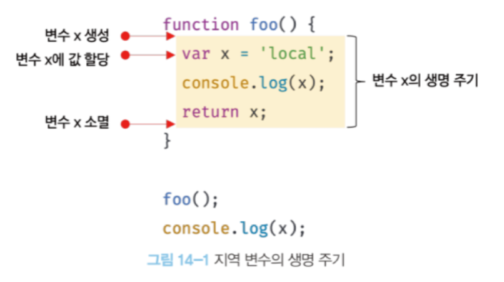

# 14장 전역 변수의 문제점

**지역 변수의 생명 주기는 함수의 생명 주기와 일치한다.**

 

**호이스팅은 스코프를 단위로 동작한다.**

 

### 14.2 전역 변수의 문제점

- 암묵적 결합
- 긴 생명 주기
  - 전역 변수의 생명 주기는 애플리케이션의 생명 주기와 같다.  
    때문에 메모리 리소스도 오랜 기간 소비한다.
- 스코프 체인 상에서 종점에 존재
  - 전역 변수는 스코프 체인 상 종점에 위치한다.
  - 이는 변수를 검색할 때 전역 변수가 가장 마지막에 검색된다는 것을 의미한다.  
    즉, 변수 검색 속도가 가장 느리다.
- 네임스페이스 오염

  

**변수 스코프는 좁을수록 좋다**

 

### 14.3.4 ES6 모듈

ES6 모듈을 사용하면 전역 변수를 사용할 수 없다.

**ES6 모듈은 파일 자체의 독자적인 모듈 스코프를 제공한다.**

따라서 모듈 내에서 var 키워드로 선언한 변수는 더는 전역 변수가 아니며, window 객체의 프로퍼티도 아니다.
