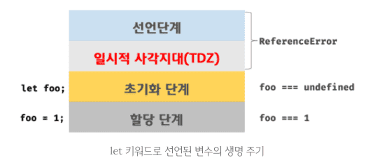

# 15장 let, const 키워드와 블록 레벨 스코프

var 키워드로 선언한 변수는 오로지 함수의 코드 블록만을 지역 스코프로 인정한다.

```js
// 예제 1
const func = () => {
  var a = 0;

  if (1) {
    var a = 10;
  }
  console.log(a);
};
func(); // 10
```

```js
// 예제 2
const func = () => {
  var a = 0;
  const func1 = () => {
    a = 1;
    console.log("func1 실행");
  };
  func1();
  console.log(a);
};
func(); // 1
```

```js
// 예제 3
const func = () => {
  var a = 0;
  const func1 = () => {
    var a = 1;
    console.log("func1 실행");
  };
  func1();
  console.log(a);
};
func(); // 0
```

var는 오로지 `함수`의 코드 블록만을 지역 스코프로 인정한다. <br>
let, const는 `모든 코드 블록(함수, if문, 반복문, try-catch문)`을 지역 스코프로 인정한다.

<br>

### 변수 호이스팅

var 키워드로 선언한 변수는 **런타임 이전에 선언 단계와 초기화 단계가 실행**한다. <br>
let 키워드는 **선언 단계와 초기화 단계가 분리되어 진행된다.** <br>


