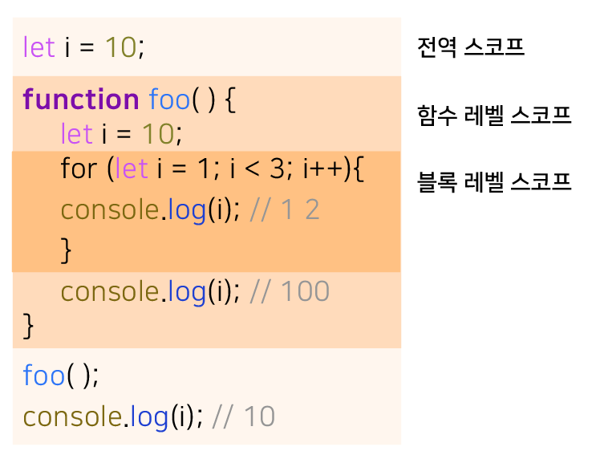

# let 키워드

var 키워드의 단점을 보완하기 위해 ES6에서는 새로운 변수 선언 키워드인 let과 const를 도입했다.

### 변수 중복 선언 금지

let 키워드로 이름이 같은 변수를 중복 선언하면 문법 에러가 발생한다.

```javascript
let x = 10;
let x = 20; // SyntaxError: Identifier 'x' has already benn declared
```

### 블록 레벨 스코프

let 키워드로 선언한 변수는 모든 코드 블록(function, if, for, while, try/catch)을 지역 스코프로 인정하는 블록 레벨 스코프를 따른다.

```javascript
let x = 1;

{
    let y = 2;
}

console.log(x); // 1
console.log(y); // ReferenceError: y is not defined
```

함수도 코드 블록이므로 스코프를 만든다. 이때 함수 내의 코드 블록은 함수 레벨 스코프에 중첩된다.



### 변수 호이스팅

let 키워드로 선언한 변수는 변수 호이스팅이 발생하지 않는 것 처럼 동작한다.

```javascript
console.log(x); // ReferenceError: x is not defined
let x;
```

let 키워드로 선언한 변수를 변수 선언문 이전에 참조하면 참조 에러가 발생한다.

#### var

**var 키워드로 선언한 변수**는 런타임 이전에 자바스크립트 엔진에 의해 암묵적으로 **선언 단계와 초기화 단계가 동시에 진행**된다.

**선언 단계에서 스코프에 변수 식별자를 등록해 자바스크립트 엔진에 변수의 존재를 알리고 즉시 초기화 단계에서 undefined로 변수를 초기화**한다.

따라서 변수 **선언문 이전에 변수에 접근해도 스코프에 변수가 존재하기 때문에 에러가 발생하지 않는다**. 다만 undefined를 반환한다.

이후 변수 **할당문에 도달하면 비로소 값이 할당**된다.

```javascript
// 호이스팅으로 인해 미리 참조 가능
console.log(x); // undefined

// 할당
x = 10;

console.log(x); // 10

// 호이스팅으로 선언과 undefined으로 초기화 동시에 진행
var x = 9999;

console.log(x); // 9999
```

#### let

**let 키워드로 선언한 변수는 선언 단계와 초기화 단계가 분리되어 진행된다.**

런타임 이전에 **자바스크립트 엔진에 의해 암묵적으로 선언 단계가 먼저 실행되지만 초기화 단계는 변수 선언문에 도달했을 때 실행 된다.**

초기화 단계가 실행되기 이전에 변수에 접근하려고 하면 참조 에러가 발생한다.

let 키워드로 선언한 변수는 **스코프의 시작 지점부터 초기화 단계 시작 지점까지 변수를 참조할 수 없다.**

시작 지점부터 초기화 시작 지점까지 **변수를 참조할 수 없는 구간을 일시적 사각지대(Temporal Dead Zone; TDZ)라고 부른다.**

```javascript
// 초기화 이전의 사각지대에서는 참조가 불가능
console.log(x); // ReferenceError: x is not defined

let x; // 선언 부분에 도달해야 초기화가 실행 이때는 초기화 값이 없어 undefined로 초기화

console.log(x); // undefined

x = 1; // undefined에서 1로 재할당
console.log(x); // 1
```

중요한 점은 let 키워드로 선언한 변수는 변수 호이스팅이 발생하지 않는 것처럼 보인다. 하지만 그렇지 않다.

자바스크립트는 ES6에서 도입된 let, const를 포함해서 모든 선언 (var, let, const, function, function\*, class)을 호이스팅 한다.

하지만 let, const, class를 사용한 선언문은 호이스팅이 발생하지 않는 것 처럼 동작한다.

### 전역 객체와 let

var 키워드로 선언한 전역 변수와 전역 함수, 그리고 선언하지 않은 변수에 값을 할당한 암묵적 전역은 전역 객체 window의 프로퍼티가 된다.

전역 객체의 프로퍼티를 참조할 때 window를 생략할 수 있다.

```javascript
var x = 1;

// 암묵적 전역
y = 2;

console.log(window.x); // 1
// window를 생략하여 참조
console.log(x); // 1

console.log(window.y); // 2
console.log(y); // 2
```

let 키워드로 선언한 전역 변수는 전역 객체의 프로퍼티가 아니다. let 전역 변수는 보이지 않는 개념적인 블록 내에 존재하게 된다.

```javascript
let x = 1;

console.log(window.x); // undefined
console.log(x); // 1
```

<hr>
