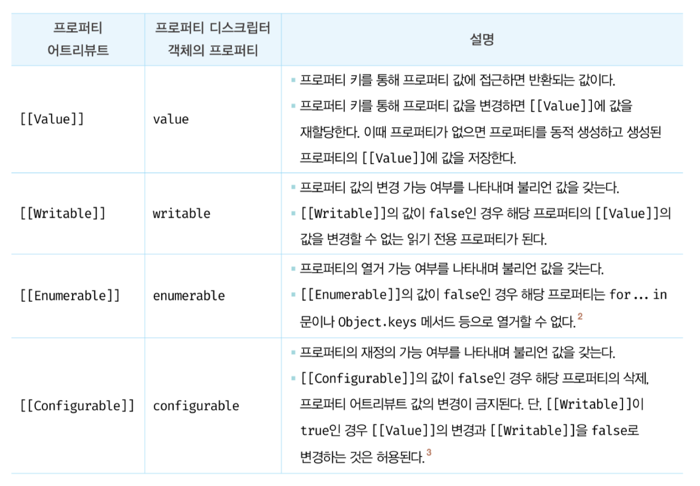
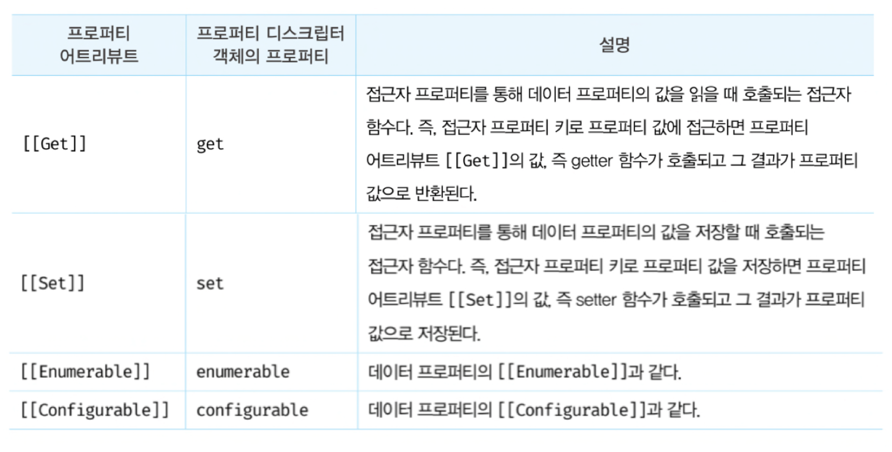
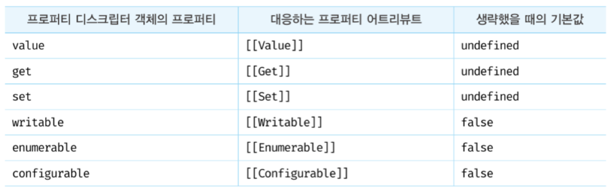
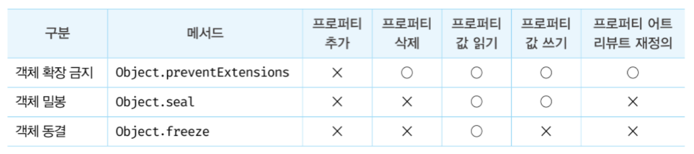

# 16장 프로퍼티 어트리뷰트

### 16.1 내부 슬롯과 내부 메서드

내부 슬롯과 내부 메서드는 직접 접근할 수 있는 공개된 객체 프로퍼티가 아니다.

단, 일부 내부 슬롯과 내부 메서드는 간접적으로 접근할 수 있는 수단을 제공한다. <br>
예를 들어 [[Prototype]] 내부 슬롯은 `__proto__` 접근자 프로퍼티로 간접적으로 접근할 수 있다.

```js
const o = {};
o.[[Prototype]] // Uncaught SyntaxError: Unexpected token '['
o.__proto__ // Object.prototype
```

<br>

### 16.2 프로퍼티 어트리뷰트와 프로퍼티 디스크립터 객체

JS 엔진은 프로퍼티를 생성할 때 프로퍼티의 상태를 나타내는 프로퍼티 어트리뷰트를 기본값으로 자동 정의한다. <br>

프로퍼티 어트리뷰트는 JS 엔진이 관리하는 내부 상태 값 (meta-property)인 내부 슬롯 [[Value]], [[Writable]], [[Enumerable]], [[Configurable]]을 말한다. <br>

프로퍼티 어트리뷰트에 집적 접근할 순 없지만, Object.getOwnPropertyDescriptor 메서드를 사용하여 간접적으로 확인할 수 있다.

<br>

### 16.3 데이터 프로퍼티와 접근자 프로퍼티

- 데이터 프로퍼티 : 키와 값으로 구성된 일반적인 프로퍼티 <br>
  ex) Value, Writable, Enumerable, Configurable

- 접근자 프로퍼티 : 자체적으로는 값을 갖지 않고 다른 데이터 프로퍼티의 값을 읽거나 저장할 때 호출되는 접근자 함수로 구성된 프로퍼티 <br>
  ex) Get, Set, Enumerable, Configurable

<br>

#### 16.3.1 데이터 프로퍼티



일반적인 객체의 경우 [[Value]]의 값은 프로퍼티 값으로 초기화되며, 나머지는 true로 초기화된다. <br>

#### 16.3.2 접근자 프로퍼티



<br><br>

### 16.4 프로퍼티 정의

Object.defineProperty 메서드를 사용하면 프로퍼티 어트리뷰트를 직접 정의할 수 있다. <br>

```js
const person = {};

// 데이터 프로퍼티 정의
Object.defineProperty(person, "firstName", {
  value: "GeonHo",
  writable: true,
  enumerable: true,
  configurable: true,
});

Object.defineProperty(person, "lastName", {
  value: "Lee",
});

let descriptor = Object.getOwnPropertyDescriptor(person, "firstName");
console.log("firstName", descriptor);
// firstName {value: "GeonHo", writable: true, enumerable: true, configurable: true}

descriptor = Object.getOwnPropertyDescriptor(person, "lastName");
console.log("lastName", descriptor);
// lastName {value: "Lee", writable: false, enumerable: false, configurable: false}

// 디스크립터 객체의 프로퍼티를 누락시키면 undefined, false가 기본값이다.
```

**defineProperty를 사용하지 않은 기본 값의 경우 true지만, defineProperty를 사용할 때, 선언 값 외에는 false로 정의된다.**



<br><br>

### 16.5 객체 변경 방지

JS는 객체 변경을 방지하는 다양한 메서드가 있다.


### 16.5.1 객체 확장 금지

Object.preventExtensions 메서드는 객체의 확장을 금지한다. <br>
즉, 확장이 금지된 객체는 프로퍼티 추가가 금지된다. <br>

<br>

### 16.5.2 객체 밀봉

Object.seal 메서드는 객체를 밀봉한다. <br>
밀봉된 객체는 읽기와 쓰기만 가능하다.

<br>

### 16.5.3 객체 동결

Object.freeze 메서드는 객체를 동결한다.
<br>
동결된 객체는 읽기만 가능하다.

<br>

### 16.5.4 불변 객체

Object.freeze 메서드로 동결을 하여도, 객체 내부의 객체는 적용되지 않는다.

내부 객체까지 변경 불가능한 읽기 전용의 `불변 객체`를 구현하기 위해서는 모든 프로퍼티에 재귀적으로 Object.freeze 메서드를 호출해야 한다.
