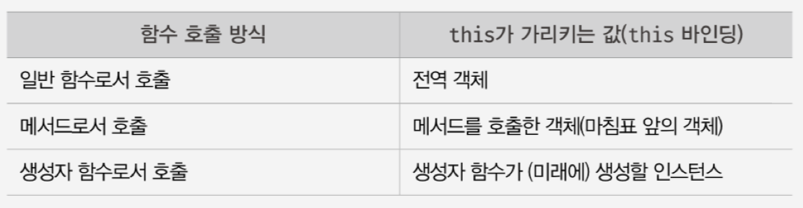

# 17장 생성자 함수에 의한 객체 생성

### 17.1 Object 생성자 함수

```js
const person = new Object();
```

JS는 Object 외에도 String, Number, Boolean, Function, Array, Date, RegExp, Promise 등의 빌트인 생성자 함수를 제공한다.

빌트인 생성자 함수의 리턴 값은 `객체`이다.

```js
const strObj = new String("Lee");
console.log(typeof strObj); // object
console.log(strObj); // String {"Lee"}
```

<br>
<hr>

### 17.2 생성자 함수

객체 리터럴에 의한 객체 생성 방식은 단 하나의 객체만 생성한다.

객체는 **프로퍼티**를 통해 객체 고유의 `상태(state)`를 표현한다. <br>
또한 **메서드**를 통해 프로퍼티를 참고하고 조작하는 `동작(behavior)`을 표현한다.

<br>

this <br>
this는 객체 자신의 프로퍼티나 메서드를 참조하기 위한 자기 참조 변수(self-referencing variable)이다. <br>
this 바인딩은 함수 호출 방식에 의해 동적으로 결정된다. <br>



<br>

생성자 함수는 객체(인스턴스)를 생성하는 함수다. <br>

new 연산자를 사용하면 생성자 함수, 사용하지 않으면 일반 함수로 동작한다.

<br>
<hr>

### 17.3 생성자 함수의 인스턴스 생성 과정

생성자 함수의 역할

- 인스턴스를 생성하는 것.
- 생성된 인스턴스를 초기화 하는 것.

<br>

new 연산자와 함께 생성자 함수를 호출할 때의 과정

1. 인스턴스 생성과 this 바인딩 <br>
   인스턴스가 생성되면 암묵적으로 빈 객체가 생성된다. <br>
   이것이 생성자 함수가 생성해낸 인스턴스다. <br>
   그리고 이 인스턴스가 this에 바인딩 된다. <br>
   (이는 프로토타입에 의해 연결되며, 런타임 이전에 실행된다.)

2. 인스턴스 초기화 <br>
   this에 바인딩되어 있는 인스턴스를 초기화한다. <br>
   즉, this에 바인딩되어 있는 인스턴스에 프로퍼티나 메서드를 추가하고 <br>
   생성자 함수가 인수로 받은 초기값을 인스턴스에 할당하여 초기화한다.

3. 인스턴스 반환 <br>
   생성자 함수에서 모든 처리가 끝나면 인스턴스가 바인딩 된 this가 암묵적으로 반환된다. <br>
   <br>

생성자 함수에는 return 문이 없다. <br>
암묵적으로 this가 반환되기 때문. <br>

<br>

그렇다면 **명시적으로 다른 객체나 원시값을 반환**하면 어떻게 될까? <br>

- 명시적으로 객체를 반환하면 this가 반환되지 않는다.
- 원시값을 반환하려하면, 원시값은 무시되고 암묵적으로 this가 반환된다.

때문에 생성자 함수에서 return 문은 생략된다.

<br>

### 내부 메서드 [[Call]]과 [[Construct]]

함수는 객체다. <br>

근데 `일반 객체는 호출할 수 없지만, 함수는 호출할 수 있다`. <br>
이는 함수 객체만이 가지는 내부 메서드 [[Call]]과 [[Construct]]를 갖고 있기 때문이다. <br>
( 또한 함수는 [[Environment]], [[FormalParameters]] 등의 내부 슬롯도 갖고 있다 )<br>

함수를 일반 함수로써 호출하면 [[Call]]이 호출되고, <br>
생성자 함수로써 호출하면 [[Construct]]가 호출된다. <br>

[[Call]]을 갖는 함수는 callable이라고 하고, <br>
[[Construct]]를 갖는 함수는 constructor라고 한다. <br>
[[Construct]]를 갖지 않는 함수는 non-constructor라고 한다. <br>
( 이를 통해, 함수는 반드시 [[Call]]을 가져야 하고, [[Construct]]는 선택적이라는 것을 알 수 있다. ) <br>

<br>

constructor 와 non-constructor 는 어떤게 있을까?

- constructor : 일반 함수, 메서드(ES6 메서드 축약 표현), class
- non-constructor : 메서드(ES6 메서드 축약 표현), 화살표 함수

<br>

만약 화살표 함수를 생성자 함수로 호출하려하면, TypeError가 발생한다. <br>

<br>

음. 일반 함수와 생성자 함수에 특별한 형식적 차이는 없기에, 이를 구분하기 위해 생성자 함수는 보통 파스칼 케이스로 명명한다.

다만, 개발자가 조심하더라도 실수를 할 수 있다. <br>
때문에 new.target 키워드를 활용해 생성자 함수로서 호출되었는지 확인할 수 있다. <br>

new.target은 this와 유사하게, constructor인 모든 ' 함수 내부 '에서 암묵적인 지역 변수와 같이 사용되며, **메타 프로퍼티**라고 부른다.

<br>

```js
function Circle(r) {
  // 이 함수가 new 연산자와 함께 호출되지 않았다면 new.target은 undefined다.
  if (!new.target) {
    return new Circle(r);
    // new 연산자와 함께 호출하여 생성된 인스턴스를 반환한다.
  }
}
```

<br>

혹은 ' 스코프 세이프 생성자 패턴 '을 활용할 수 있다. <br>
이는 ES6에서 도입된 최신 문법인 new.target을 사용할 수 없을 때 사용할 수 있다.

```js
function Circle(r) {
  // 이 함수가 new 연산자와 함께 호출되지 않았다면 new.target은 undefined다.
  if (!(this instanceof Circle)) {
    return new Circle(r);
    // new 연산자와 함께 호출하여 생성된 인스턴스를 반환한다.
  }
}
```

<br>

추가로, Object와 Function 생성자 함수는 new 연산자와 함께 호출하지 않아도 new 연산자와 함께 호출한 것처럼 동작한다. <br>
하지만 String, Number, Boolean 생성자 함수는 new 연산자와 함께 호출하지 않으면 일반 함수로서 호출된다.
