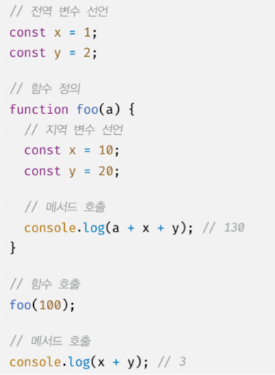
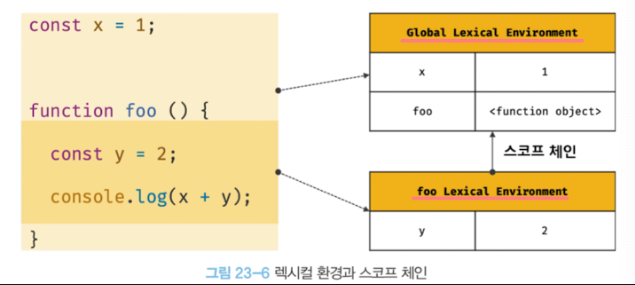
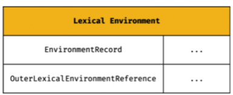
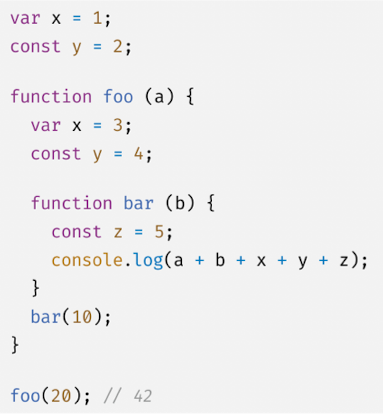
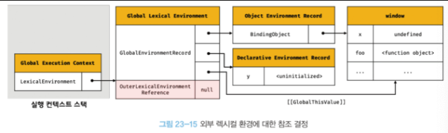

# 23장 실행 컨텍스트

1. 소스코드의 타입
   - 전역 코드
   - 함수 코드
   - eval 코드
   - 모듈 코드
2. 소스코드의 평가와 실행
   모든 소스코드는 실행 전 평과 과정을 거친다.
   즉 JS 엔진은 소스코드를 '평가' 와 '실행' 과정으로 나누어 처리한다.

   '평가'과정에서는 실행 컨텍스트를 생성하고, 변수나 함수 선언문만 실행하여
   실행 컨텍스트가 관리하는 스코프(렉시컬 환경의 환경 레코드)에 등록한다

   평가 과정 이후 '실행'과정이 시작된다. 즉 런타임이 시작된다.
   변수나 함수에 대한 정보는 실행 컨텍스트가 관리하는 스코프에서 가져온다.
   또 변수 값의 변경 등은 다시 스코프에 등록한다.

3. 실행 컨텍스트의 역할

   

   위와 같은 상황에서, 각 코드들을 스코프에 맞게 구분하여 관리하게 위하여
   스코프, 식별자, 코드 실행 순서 등의 관리가 필요하다.

   이를 위해 실행 컨텍스트가 존재한다.

   실행 컨텍스트는 식별자를 등록하고 관리하는 스코프와 코드 실행 순서 관리를 구현한 내부 매커니즘으로,
   모든 코드는 실행 컨텍스트를 통해 실행되고 관리된다.

   식별자와 스코프는, 실행 컨텍스트의 렉시컬 환경으로 관리하고,
   코드 실행 순서는 실행 컨텍스트 스택으로 관리한다.

4. 실행 컨텍스트의 스택
   JS 엔진은 먼저 전역 코드를 평가하여 '전역' 실행 컨텍스트를 생성한다.
   그러다 함수가 호출되면, 함수 코드를 평가하여 '함수' 실행 컨텍스트를 생성한다.
   이렇게 생성된 실행 컨텍스트는 스택 자료구조로 관리되는데, 이를 실행 컨텍스트 스택이라고 한다.
5. 렉시컬 환경
   실행 컨텍스트가 코드 실행 순서를 관리한다면,
   렉시컬 환경은 스코프와 식별자를 관리한다.
   

   사진과 같이, 렉시컬 환경은 key | value 형태의 객체 스코프이다.
   실행 컨텍스트는 렉시컬 환경과 변수 환경으로 구성되어있는데,
   일단 간략하게 배우기 위해, 두개를 합쳐 렉시컬 환경이라 하겠다.

   렉시컬 환경은 두 개의 컴포넌트로 구성된다.

   

   1. 환경레코드
      스코프에 포함된 식별자와 바인딩 된 값을 관리한다.

   2. 외부 렉시컬 환경에 대한 참조
      상위 스코프, 즉 해당 실행 컨텍스트를 생성한 소스코드를 포함하는 렉시컬 환경을 가르킨다.

6. 실행 컨텍스트의 생성과 식별자 검색 과정

   

   위 코드의 실행 컨텍스트와 렉시컬 환경에 대해 아라보자.

   

   우선 전역 먼저.
   전역 실행 환경에서 전역 렉시컬 환경을 생성하고 전역 렉시컬 환경을 바인딩.
   전역 환경 레코드는 var같은 객체 환경 레코드와 const, let 같은 선언 환경 레코드를 분리해서 바인딩한다.
   var의 경우 변수의 선언 단계와 초기화 단계가 동시에 진행되다보니 전역 객체에 바로 undefined가 할당된다.

   허나 let, const는 선언 단계 후 초기화 단계가 분리되어 실행되기에,
   런타임이 변수 선언문에 닿아 값이 할당되기 전 까지, 변수에 접근할 수 없는 일시적 사각지대에 빠지게 된다.
   때문에 y에 <uninitialized>가 바인딩되어있다.

   this도 전역 환경 레코드 내부 슬롯에 바인딩 된다.

   외부 렉시컬 환경 참조에는 null 이 할당된다. 왜냐면 전역이라 참조할 곳이 없기 때문.

   이렇게 전역 실행 컨텍스트와 렉시컬 환경에 대하여 알아보았다.
   마지막으로 전역 코드가 실행되면 x, y에 값이 할당되고, foo 함수가 호출된다.

   소스코드를 보면, 동일한 이름의 식별자가 각기 다른 스코프에 존재할 수 있다.
   이럴때 JS는 식별자 결정을 위해 실행중인 실행 컨텍스트에서부터 식별자를 검색하기 시작한다.
   이때 식별자를 못찾으면, 외부 렉시컬 환경이 가르키는 상위 스코프로 이동하여 식별자를 검색한다.
