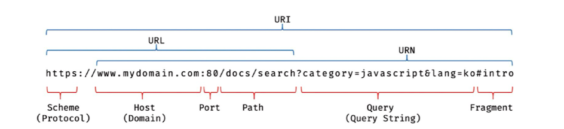

Node.js 의 등장으로 JavaScript는 웹 브라우저를 벗어나

서버 사이드 애플리케이션 개발에서도 사용가능한 범용 개발 언어가 되었음

운영체제, 가상머신 위에서 실행되는 다른 언어와 JS는 다르게 브라우저에서 HTML CSS 와 함께 실행됨

> **파싱?**
>
> 프로그래밍 언어의 문법에 맞게 작성된 텍스트 문서를 읽어
>
> 실행하기 위해 문서의 문자열을 토큰으로 분해하고, 토큰에 문법적 의미와 구조를 반영하여 트리구조의
>
> 자료구조인 파스 트리를 생성하는 과정을 의미

> **렌더링?**
>
> HTML CSS JS로 작성된 문서를 파싱후 브라우저에 시각적으로 출력하는 것을 의미

### 요청 응답

브라우저의 핵심 기능은

💡 필요한 리소스 ( HTML, CSS, JS, 이미지, 폰트 등..)를 서버에 요청하고 응답받아 렌더링 하는것

서버에 요청을 하기 위해 주소창이 존재함

루트 요청 ⇒ 스킴(프로토콜) 과 Host 만으로 구성된 URL 로 `index.html`을 암묵적으로 응답받음

### HTTP 1.1 & HTTP 2.0

💡 HTTP? 웹에서 브라우저와 서버가 통신을 위한 프로토콜 (규약)

HTTP 연대기

- 1991년 : 최초의 문서화
- 1996년 : HTTP/1.0
- 1999년 : HTTP/1.1
- 2005년 : HTTP/2.0

**HTTP 1.1 과 2.0 의 차이**

- 1.1 은 커넥션당 하나의 요청 응답만 처리가능함
  즉 모든 리소스를 받아올때 모든 리소스의 요청이 개별적으로 전송되고, 응답또한 개별적으로 전송됨
  따라서 리소스 요청 갯수에따라 응답 시간이 매우 증가함
  2.0 은 커넥션당 여러개의 요청과 응답 처리가 가능함
  모든 리소스가 동시에 전송이 가능하여 1.1에 비해 약 50%정도의 속도가 빨라짐

### HTML 파싱 & DOM 생성

HTML 문서는 문자열로 이루어진 순수한 텍스트!

이런 순수한 텍스트로 브라우저에 시각적인 렌더링을 하기위해 브라우저가 이해가능한 자료구조로 변환하여야함

이후 파싱된 HTML 문서를 통해 DOM 을 생성함

즉! DOM 은 HTML 문서를 파싱한 결과물

### CSS 파싱 & CSSOM 생성

HTML문서를 순서대로 읽으며 DOM 을 생성하는중 `link` `style` 태그를 만나면 DOM 생성을 일시 중단함

- 이후 link 의 경우 href 에 지정된 파일을 서버에 요청
- 이후 CSS을 HTML와 동일한 파싱 과정을 통해 해석하여 CSSOM 를 생성
- 그리고 CSS 파싱이 완료도면 다시 HTML 파싱을 중단된 부분부터 이어나감

### 렌더 트리

💡 렌더트리 render tree? 렌더링을 위한 트리 구조의 자료구조

서버로 부터 응답받은 HTML CSS 를 파싱하여 DOM 과 CSSOM 을 생성하면

DOM 과 CSSOM을 렌더링 하기위해 렌더 트리 ( render tree ) 로 결합됨

이과정에서 HTML의 meta tag or CSS의 display:none 과 같은 비표시 노드들은 렌더 트리에 포함되지 않음

렌더트리 안에는 브라우저 화면에 렌더링된 노드만 구성됨

이후 완료된 렌더 트리는 HTML Element의 레이아웃을 계산하는 데 사용되고

펙셀을 렌더링하는 페인팅 처리에 입력됨

- 렌더링 과정이 발생하는 작업
  - JS에 의한 node 의 추가 삭제
  - 브라우저 창의 리사이징으로 인한 뷰포트 크기 변경
  - HTML Elment의 레이아웃 크기를 변경시키는 style의 변경

### JavaScript 파싱 & 실행

CSS와 마찬가지로 HTML을 한줄씩 파싱하는중 `script tag` 를 만나면 DOM 생성을 일시 중단함

그리고 src 속성에 정의된 파일을 서버에 요청하고 JS 파일의 파싱을 위해 JS엔진에게 제어권을 넘김

이후 JS 파싱 종료후 다시 HTML 파싱이 종료된 부분부터 작업이 이어짐

JS 엔진은 JS code를 파싱하여 CPU가 이해할 수 있는 저수준 언어로 변환하고 실행함

여러 종류의 엔진이 존재하지만 모든 엔진은 ECMAScript 사양을 준수함

**만약.. JS code가 DOM CSSOM 를 변경한다면?**

- 일단 DOM CSSOM이 JS code 명령에 맞게 변환되어짐
- 변경된 DOM CSSOM가 다시 렌더 트리로 결합되어짐
- 변경된 렌더 트리를 기반으로 레이아웃, 페인트 과정을 거치고 다시 렌더링됨

🔥 이 과정을 리플로우 `reflow` 리페인트 `repaint` 라고함

리플로우는 레이아웃이 계산을 다시하는것을 의미

- 노드 추가 삭제
- 요소 크기, 위치 변경

리페인트는 재결합된 렌더 트리를 기반으로 다시 페인트 하는것

🔥리플로우, 리페인트는 동시에 작업되지 않고, 레이아웃에 변화가 없을땐 리페인트만 실행됨

### JavaScript 파싱에 의한 HTML 파싱 중단

HTML 파싱 과정은 병렬이 아닌 위에서 아래로의 직렬적으로 파싱이 수행됨

⇒ 따라서 script 위치에 따라 HTML 파싱이 블로킹 되어 DOM 생성이 지연될 수 있음

body 태그 가장 아래 script 태그를 선언하는것이 가장 안전함

그리고 이런 문제를 해결하기 위해 `async` 와 `defer` 어트리뷰트가 생겨남

### async defer

두개 모두 `src`를 통해 외부에서 JS 파일을 불러오는 경우에만 사용가능함!

⇒ 인라인 JS 에서는 사용 불가능

- async

  HTML 파싱과 JS파일을 불러오는 과정이 비동기적으로 진행됨

  이후 JS파일의 파싱과 실행은 JS 파일을 불러온 후 진행되고 파싱, 실행 과정에서는 HTML 파싱이 중단됨

  - 여러개의 script 파일을 불러오는 경우 순서가 보장되지 않음

- defer
  HTML 파싱과 JS파일을 불러오는 과정이 비동기적으로 진행됨
  단! JS파일이 파싱과 실행은 DOM 생성이 완료된 직후에 실행됨
