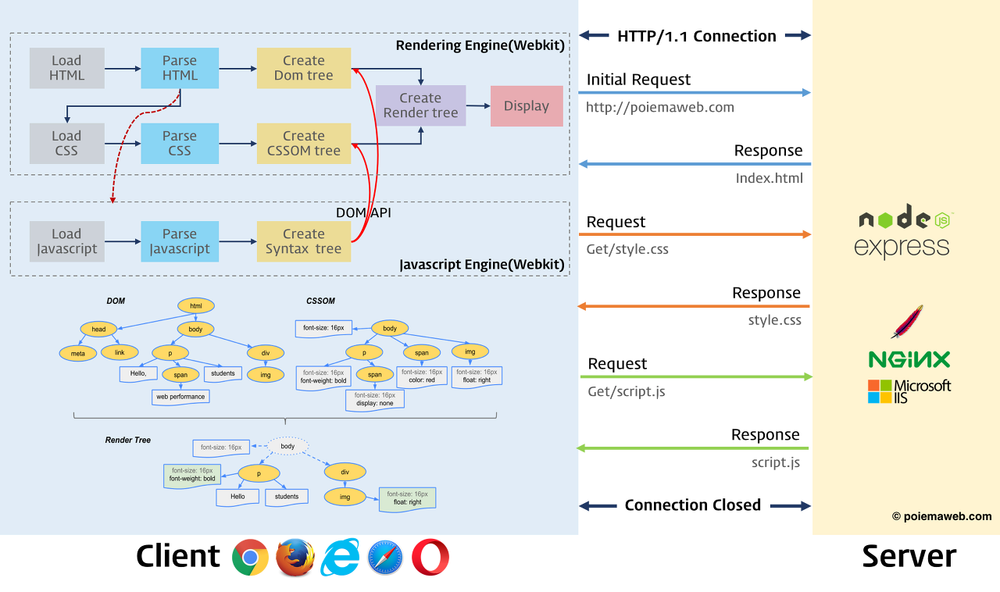

# 브라우저의 렌더링 과정

대부분의 프로그래밍 언어는 운영체제나 가상 머신 위에서 실행되지만 웹 애플리케이션의 클라이언트 사이드 자바스크립트는 브라우저에서 HTML, CSS와 함께 실행된다.

> 파싱 : 텍스트 문서를 읽어 들여 실행하기 위해 텍스트 문서의 문자열을 토큰으로 분해하고 문법적 의미와 구조를 반영하여 트리 구조의 자료구조인 파스 트링를 생성하는 일련의 과정

> 렌더링 : 렌더링은 HTML, CSS, 자바스크립트로 작성된 문서를 파싱하여 브라우저에 시각적으로 출력하는 것

### 렌더링 과정

-   브라우저는 HTML, CSS, 자바스크립트, 이미지, 폰트 파일 등 렌더링에 필요한 리소스를 요청하고 서버로부터 응답 받는다.

-   브라우저의 **렌더링 엔진**은 서버로부터 응답된 HTML과 CSS를 파싱하여 DOM과 CSSOM을 생성하고 이 둘을 결합하여 렌더 트리를 생성

-   브라우저의 **자바스크립트 엔진**은 서버로부터 응답된 자바스크립트를 파싱하여 AST를 생성하고 바이트 코드로 변환하여 실행한다. 이때 자바스크립트는 DOM API를 통해 DOM이나 CSSOM에 접근하여 변경할 수 있다. 변경된 DOM과 CSSOM은 다시 렌더트리로 결합된다.

-   렌더 트리를 기반으로 HTML 요소의 레이아웃을 계산하고 브라우저 화면에 HTML 요소를 페인팅한다.

 

# 요청과 응답

브라우저의 핵심 기능은 필요한 리소스를 서버에 요청하고 서버로부터 응답받아 브라우저에 시각적으로 렌더링하는 것이다.

브라우저의 렌더링 엔진이 HTML(index.html)을 파싱하는 도중에 외부 리소스를 로드하는 태그, 즉 CSS 파일을 로드하는 link 태그, 이미지 파일을 로드하는 img태그, 자바스크립트를 로드하는 script 태그 등을 만나면 HTML 파싱 작업을 일시 중지하고 해당 리소시 파일을 서버로 요청한다.
