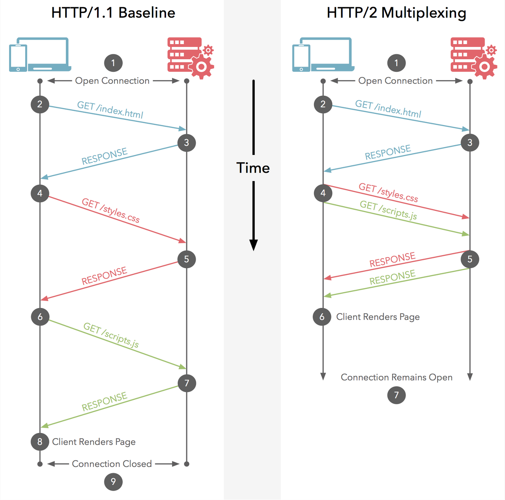

# HTTP 1.1과 HTTP 2.0

HTTP는 웹에서 브라우저와 서버가 통신하기 위한 프로토콜(규약)이다.

### HTTP/1.1

HTTP/1.1은 커넥션당 하나의 요청과 응답만 처리한다. 여러 개의 요청을 한 번에 전송할 수도 없고 응답 또한 마찬가지다.

CSS 파일을 로드하는 link 태그, 이미지 파일을 로드하는 img태그, 자바스크립트를 로드하는 script 태그 등에 대한 리소스 요청이 개별적으로 전성되고 응답 또한 개별적으로 전송된다.

HTTP/1.1은 리소스의 동시 전송이 불가능한 구조이므로 요청할 리소스의 개수에 비례하여 응답 시간이 증가하는 단점이 있다.

### HTTP/2.2

HTTP/2는 커넥션당 여러 개의 요청과 응답이 가능하다.

HTTP/2.0은 여러 리소스의 동시 전송이 가능하므로 HTTP/1.1에 비해 페이지 로드 속도가 약 50%정도 빠르다고 알려져있다.

