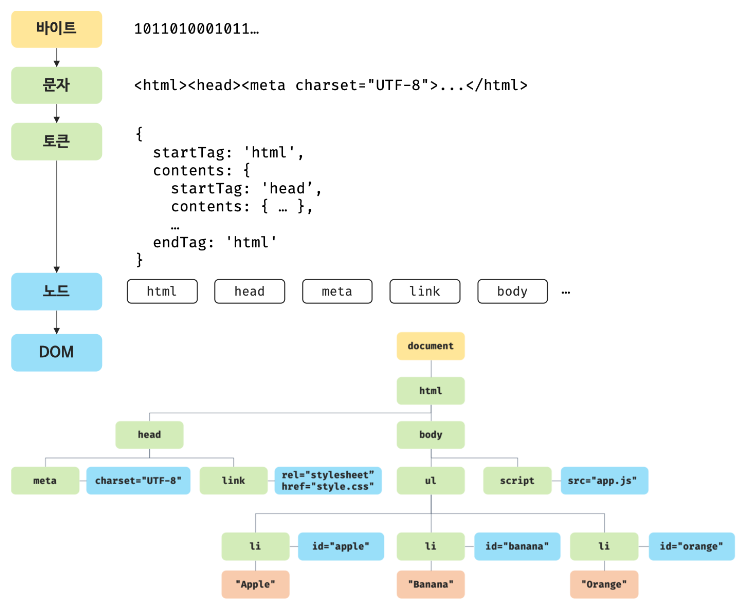

# HTML 파싱과 DOM 생성

브라우저의 요청에 의해 서버가 응답한 HTML 문서는 그냥 문자열로 이루어진 텍스트다.

텍스트인 HTML 문서를 브라우저에 시각적인 픽셀로 렌더링하려면 HTML 문설르 브라우저가 이해할 수 있는 객체로 변환하여 메모리에 저장해야 한다.

### HTML 파싱과 DOM 생성 과정

브라우저의 **렌더링 엔진**은 HTML 문서를 파싱하여 브라우저가 이해할 수 있는 자료구조 **DOM**을 생성한다.

-   서버에 HTMl 파일이 브라우저의 요청에 의해 응답되고 서버는 브라우저가 요청한 HTML 파일을 읽어 메모리에 저장한 다음 메모리에 저장된 바이트(2진수)를 응답한다.

-   브라우저는 서버가 응답한 HTML 문서를 바이트(2진수) 형태로 응답받고 응답받은 바이트 형태의 HTML 문서는 meta 태그의 charset 속성에 의해 지정된 인코딩 방식을 기준으로 문자열로 변환된다.

-   문자열로 변환된 HTML 문서를 읽어 문법적 의미를 갖는 코드의 최소 단위 토큰들로 분해된다.

-   각 토큰들을 객체로 변환하여 노드들을 생성하고 토큰의 내용에 따라 문서, 요소, 어트리뷰트, 텍스트 노드가 생성되며 노드는 이후 DOM을 구성하는 기본 요소다.

-   HTML 문서는 중첩 관계를 가질 수 있으며 중첩 관계에 의해 부자 관계가 형성된다. HTML 요소 간의 **부자 관계를 반영하여 모든 노드들을 트리 자료구조로 구성하게 되는데 만들어진 트리 자료구조를 DOM**이라 부른다.

즉 DOM은 HTMl 문서를 파싱한 결과물이다.

