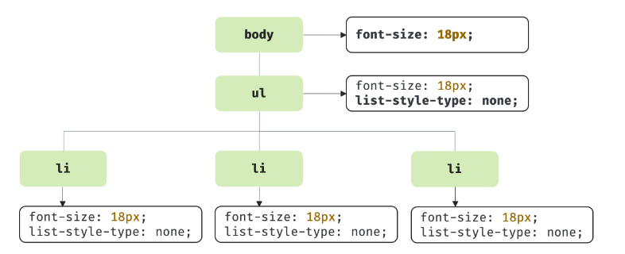

# CSS 파싱과 CSSOM 생성

**렌더링 엔진**은 HTML을 순차적으로 파싱하여 DOM을 생성해 나간다. 이처럼 렌더링 엔진은 **DOM을 생성해 나가다가 CSS를 로드하는 link, style 태그를 만나면 DOM 생성을 일시 중단**한다.

후에 CSS 파일을 서버에 요청하여 응답받고 HTML과 동일한 파싱 과정(바이트 -> 문자 -> 토큰 -> 노드 -> CSSOM)을 거쳐 해석하여 CSSOM을 생성한다.

**CSS 파싱을 완료하면 HTML 파싱이 중단된 지점부터 다시 HTML을 파싱하기 시작하여 DOM 생성을 재개**한다.

