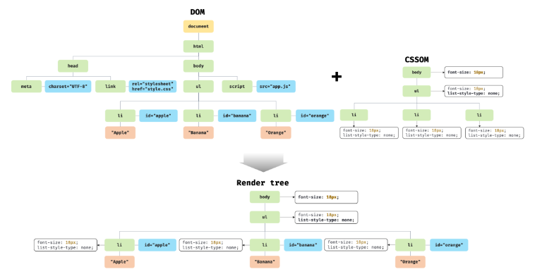

# 렌더 트리 생성

**렌더링 엔진**은 서버로 부터 응답받은 HTML, CSS를 파싱하여 DOM과 CSSOM을 생성하고 DOM과 CSSOM을 렌더링을 위한 **렌더트리로 결합**된다.

### 렌더 트리?

렌더 트리는 렌더링을 위한 트리 구조의 자료구조다. 따라서 브라우저 화면에 렌더링되지 않는 노드와 CSS에 의해 비표시(display: none)되는 노드들은 포함하지 않는다.

렌더 트리는 HTML 요소의 레이아웃을 계산하는데 사용되며 브라우저 화면에 픽셀을 렌더링하는 페인팅 처리에 입력된다.

### 렌더링 반복 조건

브라우저의 렌더링 과정은 반복해서 실행될 수 있다.

-   자바스크립트에 의한 노드 추가 또는 삭제

-   브라우저 창의 리사이징에 의한 뷰포트 크기 변경

-   HTMl 요소의 레이아웃에 변경을 발생시키는 스타일 변경

**레이아웃 계산과 페인팅을 다시 실행하는 리렌더링은 비용이 많이 드는 작업**이며 성능에 악영향을 주는 작업이기도 하다. 그래서 리렌더링이 빈번하게 발생하지 않도록 주의해야한다.

