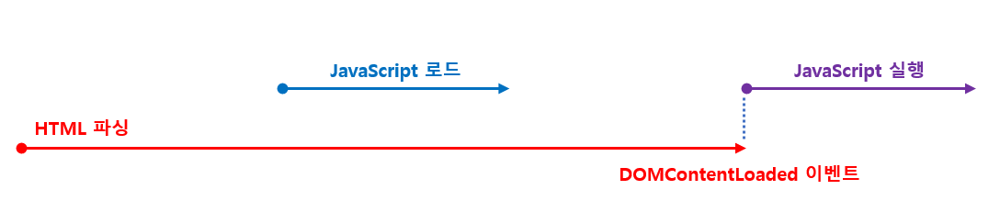

# script 태그의 async/defer 어트리뷰트

자바스크립트 파싱에 의한 DOM 생성이 중단되는 문제를 해결하기 위해 async와 defer 어트리뷰트가 추가된다.

async와 defer 어트리뷰트는 src 어트리뷰트를 통해 외부 자바스크립트 파일을 로드하는 경우에만 사용할 수 있으며 src 어트리뷰트가 없는 인라인 자바스크립트에서는 사용이 불가능하다.

async와 defer 어트리뷰트는 HTMl 파싱과 외부 자바스크립트 파일의 로드가 비동기적으로 동시에 진행된다. 하지만 자바스크립트의 실행 시점에 차이가 있다.

### async 어트리뷰트

HTMl 파싱과 외부 자바스크립트 파일의 로드가 비동기적으로 동시에 진행된다.

자바스크립트의 **파싱과 실행은 자바스크립트 파일의 로드가 완료된 직후 진행되며, 이때 HTML 파싱이 중단**된다.

만약 여러 개의 script 태그에 async 어트리뷰트를 지정하면 script 태그의 순서와는 상관없이 로드가 완료된 자바스크립트부터 먼저 실행되므로 순서가 보장되지 않는다.

따라서 순서 보장이 필요한 script 태그에는 async 어트리뷰트를 지향해야한다.

### defer 어트리뷰트

async 어트리뷰트와 마찬가지로 HTML 파싱과 외부 자바스크립트 파일의 로드가 비동기적으로 동시에 진행된다.

하지만 **자바스크립트의 파싱과 실행은 HTML 파싱이 모두 완료된 직후, 즉 DOM 생성이 완료된 직후에 진행**된다.

따라서 DOm 생성이 완료된 이후 실행되어야 할 자바스크립트에 유용하다.

