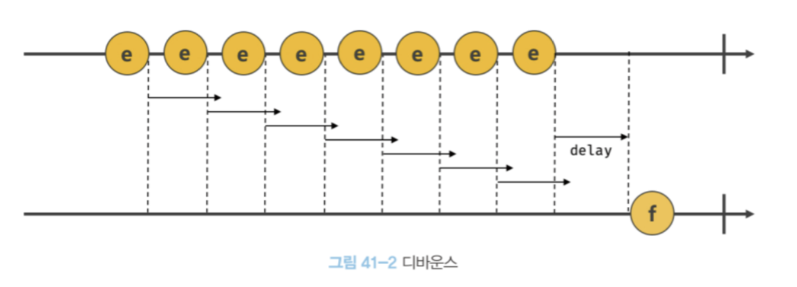
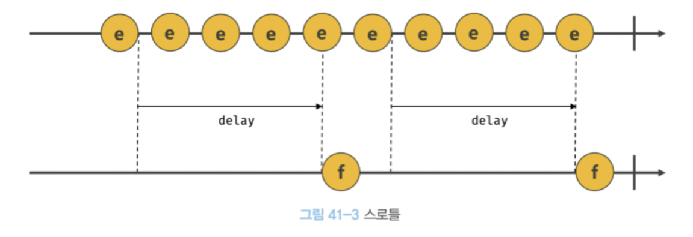

# 타이머

### 1. 호출 스케줄링

함수를 명시적으로 호출하면 함수가 즉시 실행된다.    
함수를 명시적으로 호출하지 않고일정 시간이 경과된 이후에 호출되도록 예약하려면 타이머 함수를 사용한다.  
이를 **호출 스케줄링**이라 한다.

타이머 함수는 ECMAScript 사양에 정의된 빌트인 함수가 아니다.브라우저 환경과 Node.js 환경에서 전역 객체의 메서드로 제공한다. 즉, 타이머 함수는 호스트 객체다.

자바스크립트 엔진은 단 하나의 실행 컨텍스트 스택을 갖기 때문에 두 가지 이상의 태스크를 동시에
실행할 수 없다. 즉, 자바스크립트 엔진은 싱글 스레드로 동작한다. 이런 이유로 setTimeout과 setInterval은
비동기 처리 방식으로 동작한다.

setTimeout 함수는 생성된 타이머를 식별할 수 있는 고유한 타이머 id를 반환한다.
( 브라우저일때는 숫자, Node.js일때는 객체 )
이 id를 clearTimeout 함수의 인수로 전달하여 타이머를 취소할 수 있다.

 

### 3. 디바운스와 쓰로틀링

- 디바운스
  

 

- 쓰로틀링
  
