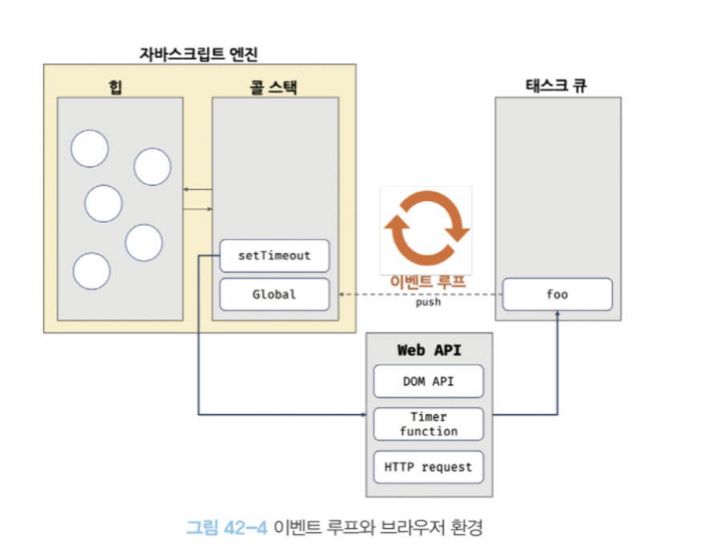

# 비동기 프로그래밍

### 동기 처리와 비동기 처리

함수를 호출하면 함수 코드가 평가되어 함수 실행 컨텍스트가
생성된다. 이때 생성된 실행 컨텍스트는 실행 컨텍스트 스택 (== 콜스택)에 푸시되고 함수 코드가 실행된다.  
함수 코드의 실행이 종료하면 함수 실행 컨텍스트는 스택에서 팝되어 제거된다.

`자바스크립트 엔진은 단 하나의 실행 컨텍스트 스택을 갖는다.`  
따라서 자바스크립트 엔진은 한 번에 하나의 태스크만 실행할 수 있는 `싱글 스레드 방식`으로 동작한다.

싱글 스레드 방식은 한 번에 하나의 태스크만 실행할 수 있기 때문에 처리에 시간이 걸리는 태스크를 실행하는 경우 `블로킹(작업 중단)`이 발생한다.

이처럼, 현재 실행 중인 태스크가 종료할 때까지 다음에 실행될 태스크가 대기하는 방식을 `동기처리`라 한다.  
순서가 보장된다는 장점이 있지만, 앞선 태스크가 종료할 때까지 이후 태스크들이 블로킹되는 단점이 있다.

이러한 단점을 해결하기 위해 `비동기 처리`가 등장했다.
비동기 처리는 현재 실행 중인 태스크가 종료되지 않은 상태라 하더라도 다음 태스크를 곧바로 실행하는 방식이다.  
예시로는 타이머 함수인 setTimeout, setInterval, 이벤트 핸들러, Ajax 요청 등이 있다.

 

### 이벤트 루프와 태스크 큐

싱글 스레드 방식은 한 번에 하나의 태스크만 처리할 수 있다는 것을 의미한다.

하지만 브라우저가 동작하는 것을 살펴보면 많은 태스크가 동시에 처리되는 것 처럼 느껴진다.

예를 들어, HTML 요소가 애니메이션 효과를 통해 움직이면서 이벤트를 처리하기도 하고,
HTTP 요청을 통해 서버로부터 데이터를 가지고 오면서 렌더링하기도 한다.

이처럼 `자바스크립트의 동시성을 지원하는 것이 바로 이벤트 루프`다.  
(이벤트 루프는 브라우저에 내장되어 있다.)  

구글의 V8 자바스크립트 엔진을 비롯한 대부분의 자바스크립트 엔진은 크게 2개의 영역으로 구분된다.

- 콜스택 : 실행 컨텍스트 스택이 바로 콜 스택이다.
- 힙 : 객체가 저장되는 메모리 공간이다. 콜 스택의 요소인 실행 컨텍스트는 힙에 저장된 객체를 참조한다.

 

콜 스택과 힙으로 구성되어 있는 자바스크립트 엔진은 단순 태스크가 요청되면 콜 스택을 통해
작업을 순차적으로 실행할 뿐이다. `비동기 처리에서 소스코드의 평가와 실행을 제외한 모든 처리는 자바스크립트 엔진을 구동하는 환경인 브라우저 또는 Node.js가 담당한다.`

예를 들어, 비동기 함수 setTimeout의 평가와 실행은 자바스크립트 엔진이 담당하지만 호출 스케줄링을
위한 타이머 설정과 콜백 함수의 등록은 브라우저 또는 Node.js가 담당한다. 이를 위해 브라우저 환경은
태스크 큐와 이벤트 루프를 제공한다.

- 태스크 큐 : setTimeout과 같은 비동기 함수의 콜백 함수 또는 이벤트 핸들러가 일시적으로 보관되는 영역이다.
  테스크 큐와는 별도로 프로미스의 후속 처리 메서드의 콜백 함수가 일시적으로 보관되는 마이크로태스크 큐도 존재한다.
- 이벤트 루프 : 이벤트 루프는 콜 스택에 현재 실행 중인 실행 컨텍스트가 있는지, 그리고 태스트 큐에 대기 중인
  함수(콜백 함수, 이벤트 핸들러 등)가 있는지 반복해서 확인한다. `만약 콜 스택이 비어있고 태스크 큐에 대기 중인
함수가 있다면 이벤트 루프는 순차적으로 태스크 큐에 대기 중인 함수를 콜 스택으로 이동시킨다.`
  이때 콜 스택으로 이동한 함수는 실행된다. 즉, 태스크 큐에 임시 보관된 함수들은 비동기 처리 방식으로 동작한다.

이처럼 비동기 함수인 setTimeout의 콜백 함수는 태스크 큐에 푸시되어 대기하다가 콜 스택이 비게 되면,
다시말해 호출된 함수가 모두 종료하면 그때 콜 스택에 푸시되어 실행된다.  

`자바스크립트는 싱글 스레드 방식으로 동작한다.
만약 모든 자바스크립트 코드가 자바스크립트 엔진에서 싱글 스레드 방식으로 동작한다면 자바스크립트는 비동기로 동작할 수 없다. 즉 브라우저는 멀티 스레드로 동작한다.`
