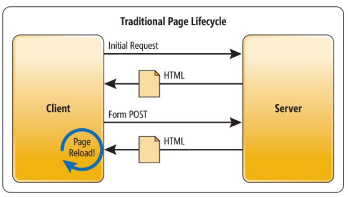
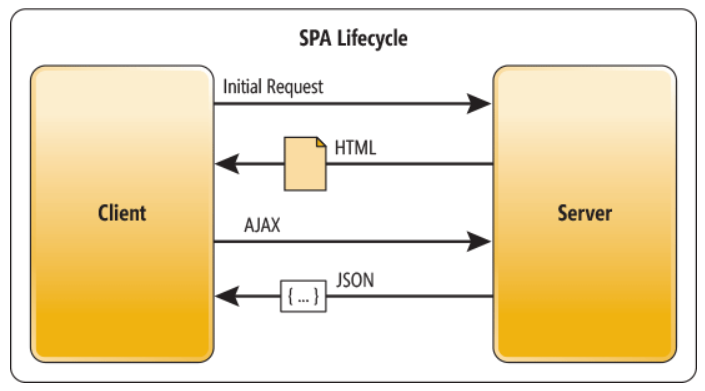

# AJAX

### 그게 먼대

Ajax란 자바스크립트를 사용하여 브라우저가 서버에게 비동기 방식으로 데이터를 요청하고,

서버가 응답한 데이터를 수신하여 웹페이지를 동적으로 갱신하는 프로그래밍 방식이다.

AJAX는 XMHHttpRequest 객체를 기반으로 동작한다.

과거 웹페이지는 html 파일을 서버로 요청 후 전송받아 페이지 전체를 리렌더링 하는 방식으로 동작했다.

이는

- 변경할 필요 없는 부분까지 처음부터 다시 렌더링한다.
- 변경할 필요가 없는 부분까지 HTML을 서버로부터 매번 다시 전송받기 때문에 불필요한 데이터 통신 발생한다.
- 서버와의 통신이 동기 방식으로 동작하기 때문에 서버로부터 응답이 있을 때까지 다음 처리는 블로킹 된다.

Ajax의 등장으로 웹페이지의 변경에 필요한 데이터만 비동기 방식으로 전송받아 변경이 필요한 부분만 다시 렌더링하는 방식이 가능해졌다. 이를 통해 브라우저에서도 데스크톱 애플리케이션과 유사한 빠른퍼포먼스와 부드러운 화면 전환이 가능해졌다.


또한 과거와 비교해서 장점으로는

- 변경할 필요 없는 부분은 다시 렌더링하지 않기 때문에 불필요한 데이터 통신이 발생하지 않는다.
- 서버와의 통신이 비동기 방식으로 동작하기 때문에 서버로부터 응답이 있을 때까지 블로킹 되지 않는다.
- 변경이 필요한 부분만 렌더링하기 때문에 빠른 퍼포먼스와 부드러운 화면 전환이 가능하다.

### JSON

JSON은 클라이언트와 서버 간의 HTTP 통신을 위한 텍스트 데이터 포맷이다.자바스크립트에 종속되지 않는 독립형 데이터 포맷으로, 대부분의 프로그래밍 언어에서 사용 가능하다.

```js
{
  "name": "Lee",
  "age": 20,
  "alive": true,
  "hobby": ["traveling", "tennis"]
}​
```

JSON의 키는 반드시 큰따옴표(작은따옴표 사용 불가)로 묶어야 한다.

<br>
<br>

JSON.stringify() <br>
클라가 서버로 객체를 전송하려면, 객체를 문자열 화 해야한다. (=> `직렬화`)

JSON.parse() <br>서버가 클라에게 전송한 JSON 문자열을 객체로 변환. (=> `역직렬화`)

### XMLHttpRequest

브라우저에서 a, form 태그를 통해 HTTP 요청 전송 기능을 제공한다면, 자바스크립트는 XMLHttpRequest 객체를 통해 HTTP 요청 전송 기능을 제공한다.

```js

```
