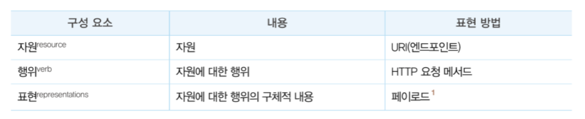

# 44장 REST API

REST는 HTTP를 기반으로 클라이언트가 서버의 리소스에 접근하는 방식을 규정한 아키텍처고,
REST API는 REST를 기반으로 서비스 API를 구현한 것을 의미한다.

 

## 44.1 REST API의 개념

REST API는 자원, 행위, 표현의 3가지 요소로 구성된다.  
REST는 자체 표현 구조로 구성되어 REST API만으로 HTTP 요청의 내용을 이해할 수 있다.

 

## 44.2 REST API 설계 원칙

REST에서 가장 중요한 기본적인 규칙은 두 가지다. 
URI는 리소스를 표현하는데 집중하고 행위에 대한 정의는 HTTP 요청 메서드를 통해 하는 것이 RESTful API를 설계하는 중심 규칙이다.
  
또한 URI는 리소스를 표현하는데 중점을 두어야 한다.  
리소스를 식별할 수 있는 이름은 동사보다는 명사를 사용한다.
