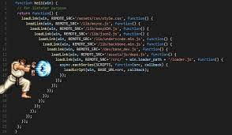
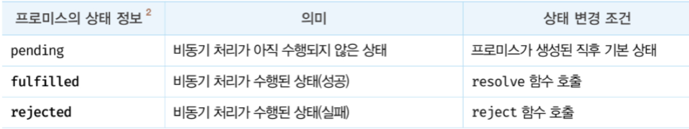
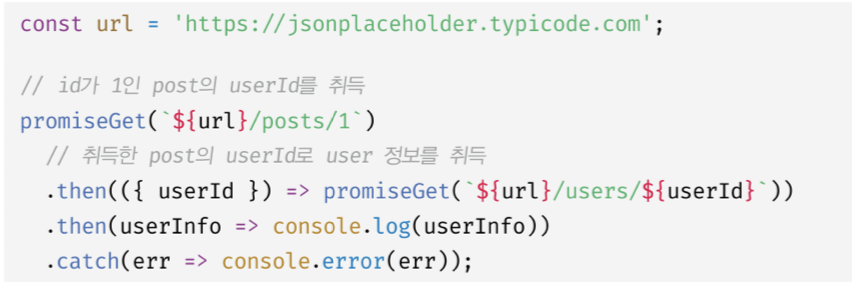

# 45장 프로미스

JS는 비동기 처리를 위해 콜백 패턴을 사용한다. <br>
하지만 전통적인 콜백 패턴은 콜백 헬로 인해 가독성이 나쁘고 비동기 처리 중 발생한 에러의 처리가 곤란하며 여러 개의 비동기 처리를 한 번에 처리하는 데도 한계가 있다.
<br>

ES6에서는 비동기 처리를 위한 또 다른 패턴으로 프로미스를 도입했다. 프로미스는 전통적인 콜백 패턴이
가진 단점을 보완하며 비동기 처리 시점을 명확하게 표현할 수 있다는 장점이 있다.

<br>

## 45.1 비동기 처리를 위한 콜백 패턴의 단점

비동기 함수란 함수 내부에 비동기로 동작하는 코드를 포함한 함수를 말한다. <br>

비동기 함수를 호출하면 **함수 내부의 비동기로 동작하는 코드가 완료되지 않았다 해도 기다리지 않고 즉시 종료된다. 즉, 비동기 코드는 비동기 함수가 종료된 이후에 완료된다.** <br>
따라서 비동기 함수 내부의 비동기로 동작하는 코드에서 처리 결과를 외부로 반환하거나 상위 스코프의 변수에 할당하면 기대한 대로 동작하지 않는다.

<br>

비동기 함수인 setTimeout 함수를 예로 들었을 때, setTimeout 함수를 호출하면 콜백 함수를 호출 스케줄링 한 다음 타이머 id를 반환한고 즉시 종료된다. <br>

```js
let num = 0;
setTimeout(() => {
  num = 10;
}, 0);

console.log(num); // 0
```

따라서 위 코드에서는 num에 값이 할당되지 않는다.

**비동기 함수는 비동기 처리 결과를 외부에 반환할 수 없고, 상위 스코프의 변수에 할당할 수도 없다. 따라서 비동기 함수의 처리 결과(서버의 응답 등)에 대한 후속 처리는 비동기 함수 내부에서 수행해야 한다.** <br>
이때 비동기 함수를 범용적으로 사용하기 위해 비동기 함수에 비동기 처리 결과에 대한 후속 처리를 
수행하는 콜백 함수를 전달하는 것이 일반적이다. 필요에 따라 비동기 처리가 성공하면 호출될 콜백 함수와
비동기 처리가 실패하면 호출될 콜백 함수를 전달할 수 있다.

하지만 후속 처리를 수행하는 비동기 함수가 또 다시 비동기 함수를 호출해야 한다면 콜백 함수 호출이중첩되어 복잡도가 높아지는 현상이 발생하는데, 이를 "**콜백 헬**"이라 한다.

( 콜백 헬 ) <br>


즉, 비동기 함수의 후속 처리의 콜백 함수가 비동기 처리의 결과값을 기준으로 또 다시 비동기 함수를 호출하는 것이다.

콜백 헬은 가독성을 나쁘게 하며 실수를 유발하는 원인이 되고, try catch 문의 에러 처리의 한계를 가진다.<br>
어떤 한계를 가지는 것일까?

```js
try {
  setTimeout(() => {
    throw new Error("Error!");
  }, 1000);
} catch (e) {
  console.error("에러를 캐치하지 못한다.");
} // ...?
```

이유는 다음과 같다.<br>

1. setTimeout이 호출된다.
2. setTimeout 함수는 비동기 함수이므로 즉시 종료되어 콜 스택에서 제거된다.
3. 이후 타이머가 만료되면(1초), setTimeout의 콜백함수는 *테스크 큐*로 푸시되고<br> 이벤트 루프에 의해 콜 스택으로 푸시된다.
4. 해당 콜백함수가 실행될 때 setTimeout 함수는 이미 콜 스택에 제거된 상태다.<br> 이는 setTimeout 함수의 콜백함수를 호출한 것이 setTimeout이 아니라는 것이다.
5. **에러는 호출자 방향으로 전파된다.**
6. 따라서 콜백함수가 리턴한 에러는 setTimeout 함수의 try-catch 블록에서 캐치되지 않는다.

<br>
이를 극복하기 위해 ES6에서 **프로미스**가 도입되었다.

<br>

## 45.2 프로미스의 생성

**프로미스는 비동기 처리 상태와 처리 결과를 관리하는 객체다.**

Promise 생성자 함수는 비동기 처리를 수행할 콜백 함수를 인수로 전달받는데 이 콜백 함수는 resolve와
reject 함수를 인수로 전달받는다.

```js
const promise = new Promise((resolve, reject) => {
  // Promise 함수의 콜백 함수 내부에서 비동기 처리를 수행한다.
  if (/* 비동기 처리 성공 */) {
    resolve('result');
  } else { /* 비동기 처리 실패 */
    reject('failure reason');
  }
});
```

프로미스는 비동기 처리에 대한 상태 정보를 갖는다.

비동기 처리가 수행되기 전을 pending, 수행 후를 settled라고 하며,
비동기 처리가 성공하면 fulfilled, 실패하면 rejected 상태가 된다. <br>

**프로미스의 상태는 resolve 또는 reject 함수를 호출하는 것으로 결정된다.**

<br>

## 45.3 프로미스의 후속 처리 메서드

(프로미스의 처리에 따라 후속적으로 처리할 작업을 등록하는 것을 후속 처리라고 한다.) <br>
**프로미스의 비동기 처리 상태가 변화하면 후속 처리 메서드에 인수로 전달한 콜백 함수가 선택적으로
호출된다.**

1. Promise.prototype.then() <br>
   then()은 두 개의 콜백 함수를 인수로 받는다.

- 첫 번째 콜백 함수는 프로미스가 fulfilled 상태가 되면 호출된다.
- 두 번째 콜백 함수는 프로미스가 rejected 상태가 되면 호출된다.

2. Promise.prototype.catch() <br>
   catch()은 프로미스가 rejected 상태일때만 호출된다.

3. Promise.prototype.finally() <br>
   finally()은 성공/실패 구분없이 반드시 한 번 호출된다.

<br>

## 45.5 프로미스 체이닝


위와 같이 프로미스 체이닝을 통하여 에러 처리가 가능하다. <br>

다만 프로미스도 콜백 패턴을 사용하므로, 가독성이 좋진 않다.<br>
이는 ES8에서 도입된 async/await 문법을 통해 해결할 수 있다.

<br>

## 45.6 프로미스 정적 메서드

Promise는 주로 생성자 함수로 사용되지만 함수도 객체이므로 메서드를 가질 수 있다.<br>
Promise는 5가지 정적 메서드를 제공한다.

- Promise.resolve / Promise.reject

- Promise.all<br>
  Promise.all 메서드는 여러 개의 비동기 처리를 모두 병렬 처리할 때 사용한다.<br>
  프로미스를 요소로 갖는 배열 등의 이터러블을 인수로 전달받는다.<br>
  첫 번째 프로미스가 가장 나중에 fulfilled 되어도, 첫 번째 프로미스의 결과부터 차례로 리턴, 즉 처리 순서가 보장된다.<br>
  또한 하나의 프로미스라도 rejected 상태가 되면, 모든 비동기 처리가 종료된다.
  <br><br>
  all()을 사용하지 않고 then() 프로미스 체이닝을 사용한다면, 인수로 전달받는 프로미스들이 순차적으로 처리되기에 앞선 비동기가 처리되어야 뒷 비동기가 처리된다.<br>
  때문에 각각의 인수들에 대한 처리의 총 합의 시간이 소요된다.<br>
  하지만 all() 메서드는 병렬적으로 프로미스를 처리하기에 가장 오래걸리는 프로미스 처리 + a 만큼만 시간이 소요된다.<br>
- Promise.race<br>
  가장 먼저 fulfilled된 프로미스를 리턴. <br>
  처리 중, 프로미스가 하나라도 rejected면 에러 처리.
- Promise.allSettled<br>
  프로미스들이 fulfilled 이든 rejected이든 모든 프로미스의 처리 결과를 담아 리턴한다.

<br>

## 45.7 마이크로태스크 큐

```js
setTimeout(() => console.log(1), 0);

Promise.resolve()
    .then(() => console.log(2));
    .then(() => console.log(3));

// 결과: 2 -> 3 -> 1
```

결과가 위와 같이 나오는 이유는 프로미스의 후속 처리 메스드의 콜백 함수가 마이크로태스크 큐에 저장되기 때문이다.
<br>
마이크로태스크 큐는 **프로미스의 후속 처리 메서드의 콜백 함수가 일시 저장된다.**<br>
(태스크 큐에는 비동기 함수의 콜백 함수나 이벤트 핸들러가 일시 저장된다.)<br>
**또한 마이크로태스크 큐는 태스크 큐보다 우선순위가 높다.** <br>

이벤트 루프가 콜 스택이 비면, 우선순위가 높은 마이크로태스크 큐의 콜백 함수를 콜 스택으로 이동시켜 실행하기에 결과가 위와 같이 나온다.<br>

<br>

## 45.8 fetch

fetch는 HTTP 요청 전송 기능을 제공하는 클라이언트 사이트 Web API다. <br>
XMLHttpRequest 객체보다 사용법이 간단하고 프로미스를 지원하기 때문에 비동기 처리를 위한 콜백 패턴의 단점에서 자유롭다.

<br>

fetch 함수는 HTTP 응답을 나타내는 Response 객체를 래핑한 Promise 객체를 반환한다.

<br>

fetch 함수가 리턴하는 프로미스는 기본적으로 404, 500 에러와 같은 HTTP 에러를 reject하지 않고, 불리언 타입의 ok 상태를 false로 설정하여 res 객체를 resolve한다.<br>
때문에 if(!res.ok) 등을 통해 명시적으로 에러를 체크하는 것이 중요하다. <br>
fetch 함수는 오프라인 등의 네트워크 장애나 cors 에러 등의 경우에만 프로미스를 reject한다.
