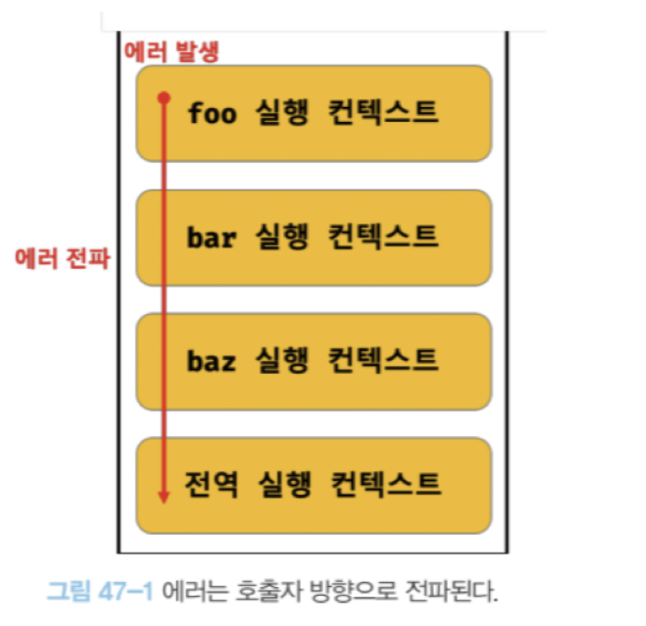

# 47장 에러 처리

에러가 발생하지 않은 코드를 작성하는 것을 불가능하다. <br>
따라서 에러는 언제나 발생할 수 있다. <br>
발생한 에러에 대해 대처하지 않고 방치하면 프로그램은 강제 종료된다. <br>
따라서 언제나 에러나 예외적인 상황이 발생할수 있다는 것을 전제하고 이에 대응하는 코드를 작성하는 것이 중요하다.

## 47.2 try-catch-finally 문

```js
try {
  // 실행할 코드(에러가 발생할 가능성이 있는 코드)
} catch (err) {
  // try 코드 블록에서 에러가 발생하면 이 코드 블록의 코드가 실행된다.
  // err에는 try 코드 블록에서 발생한 Error 객체가 전달된다.
} finally {
  // 에러 발생과 상관없이 반드시 한 번 실행된다.
}
```

<br>

## 47.3 Error 객체

Error 생성자 함수는 에러 객체를 생성한다. Error 생성자 함수에는 에러를 상세히 설명하는 에러 메세지를
인수로 전달할 수 있다.

```js
const error = new Error("invalid");
```

<br>

## 47.4 throw 문

Error 생성자 함수로 에러 객체를 생성한다고 에러가 발생하는 것은 아니다. 즉, 에러 객체 생성과
에러 발생은 의미가 다르다.

에러를 발생시키려면 try 코드 블록에서 throw 문으로 에러 객체를던저야 한다. <br>
에러를 던지면 catch 문의 에러 변수가 생성되고, 던져진 에러 객체가 할당된다. 그리고 catch 코드 블록이 실행 된다.

<br>

## 47.5 에러의 전파

에러는 호출자 방향으로 전파된다. 즉, 콜 스택의 아래 방향(실행 중인 실행 컨텍스트가 푸시되기 직전에
푸시된 실행 컨텍스트 방향)으로 전파된다.

```js
const foo = () => {
  throw Error("foo에서 발생한 에러"); // 4번
};

const bar = () => {
  foo(); // 3번
};

const baz = () => {
  bar(); // 2번
};

try {
  baz(); // 1번
} catch (err) {
  console.error(err);
}
```

1번에서 baz 함수를 호출하면 2번에서 bar 함수가 호출되고, <br>
3번에서 foo함수가 호출되고 foo 함수는 4번에서 에러를 throw한다. <br>
이때 foo 함수가 throw한 에러는 다음과 같이 호출자에게 전파되어 전역에서 캐치된다.


이처럼 throw된 에러를 캐치하지 않으면 호출자 방향으로 전파된다. <br>
이때 throw된 에러를 캐치하여 적절히 대응하면 프로그램을 강제 종료시키지 않고 코드의 실행 흐름을 복구할 수 있다. <br><br>

주의할 것은 비동기 함수인 setTimeout이나 프로미스 후속 처리 메서드의 콜백 함수는 호출자가 없다는 것이다. <br>
즉, 호출자 함수가 실행 컨텍스트가 삭제되고(컨텍스트 스택이 비어있다는 의미) <br>비동기 함수가 동작하기 때문에 전파할 호출자가 없어서 에러 처리가 힘들다.
